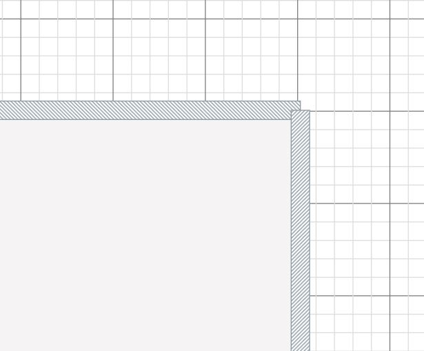
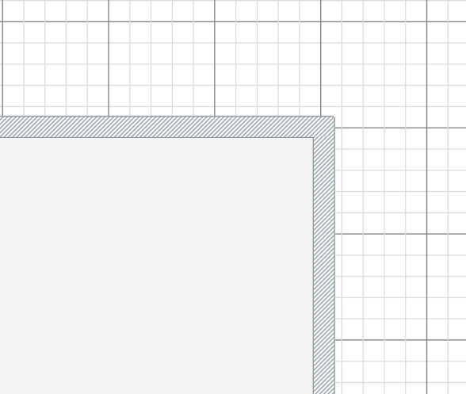

# Task_24-WallCorner

Modify existing walls to allowing drawing corners.

- fork original [react-planner](https://github.com/cvdlab/react-planner)
- add functionality of automatic corner creation after drawing two or more walls like in https://floorplanner.com/ (corners should appear after drawing/normal "segmented" walls during drawing process should be visible)

